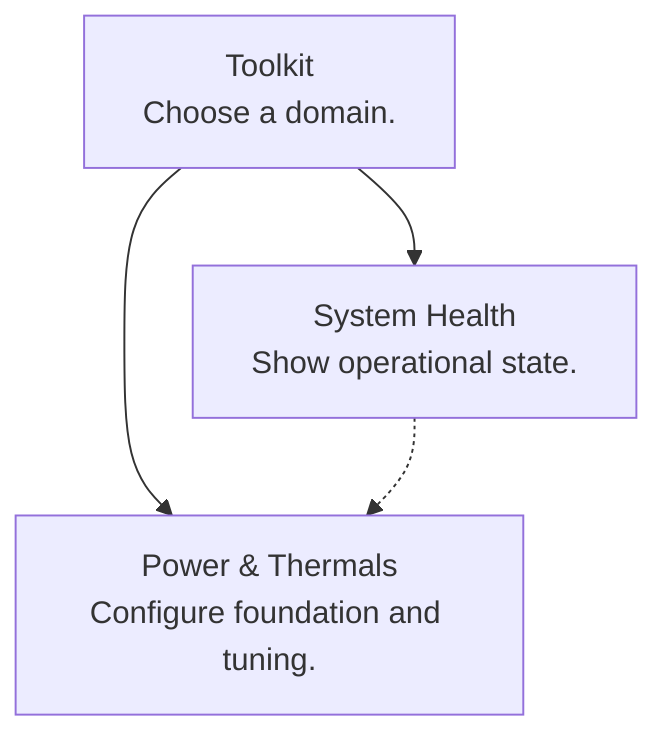

# Toolkit Menu Graph

`menus/toolkit.mmd` is the source of truth for the unified toolkit's menu
structure, ordering, titles, hints, and dependency documentation. It is valid
Mermaid and can be previewed with any Mermaid renderer.

The graph deliberately contains no shell commands. Stable `action__*` and
`child__*` IDs map to fixed adapters in `bc250-toolkit.sh`; live badges also
remain in Bash. This keeps confirmation, privilege, and failure behavior out of
the presentation format.

## Editing

1. Edit `menus/toolkit.mmd`.
2. Regenerate the marked region in `bc250-toolkit.sh`.
3. Run structural and generated-output checks.

```bash
python3 scripts/generate-menus.py --write
python3 scripts/generate-menus.py --check
python3 scripts/analyze-menu-graph.py --check --depth-budget 3
```

Do not edit the generated region in `bc250-toolkit.sh` directly.

## Mermaid Subset

The parser accepts a deliberately small, deterministic subset:



- `menu__cmd_*` nodes generate `cmd_*` menu functions.
- `action__*` nodes dispatch a fixed toolkit operation.
- `child__*` nodes launch an existing component menu.
- Every node label is `Title<br/>Hint`.
- Solid edges are selectable choices, in declaration order.
- Dotted edges document dependencies and never become choices.
- `:::entry` marks a supported direct-CLI menu that may be unreachable from the
  root. Its descendants are checked against the same depth budget.
- Back, Quit, and Escape are implicit and excluded from cycle analysis.
- Raw shell syntax, implicit nodes, chained edges, and unsupported Mermaid
  constructs are rejected.

## Current Structure

The generated toolkit graph has:

- 15 authored menus and 51 selectable nodes
- 67 navigation links and 6 dependency links
- no forward-navigation or dependency cycles
- no sibling-category detours
- no parallel choices to the same destination
- a deepest and longest authored route of three links

`drivers` and `storage-updates` remain explicit `:::entry` menus for CLI
compatibility, but are no longer part of the root taxonomy.

This first migration covers `bc250-toolkit.sh`. Component-local Power, CEC,
RAM, and maintenance menus remain handwritten and independently usable. Power
exposes direct `menu` entry points so the generated toolkit can open the
selected workflow without first showing Power's broad root menu.
