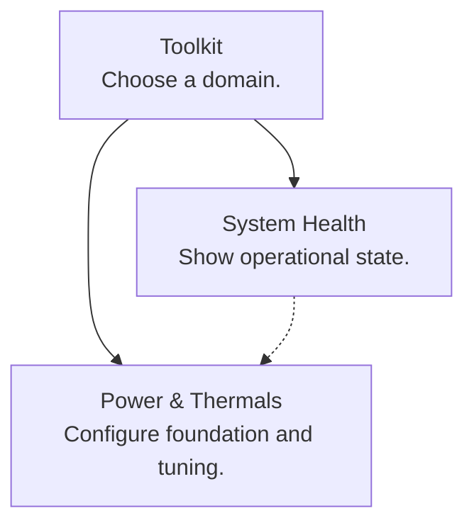

# Menu Graphs

The Mermaid files under `menus/` are the source of truth for the unified toolkit
and every standalone component menu. `menus/targets.json` maps each graph to its
Bash target, generated symbol prefix, and supported direct entries. The graphs
are valid Mermaid and can be previewed with any Mermaid renderer.

The graph deliberately contains no shell commands. Stable `action__*` and
`child__*` IDs map to fixed adapters in the target Bash script; live badges also
remain in Bash. This keeps confirmation, privilege, prompts, and failure
behavior out of the presentation format.

## Editing

1. Edit the target graph under `menus/`.
2. Regenerate every configured target.
3. Run structural and generated-output checks.

```bash
python3 scripts/generate-menus.py --write
python3 scripts/generate-menus.py --check
python3 scripts/analyze-menu-graph.py --check --depth-budget 3
```

Do not edit generated regions in the Bash targets directly. The generator
validates every graph and target before writing any file.

## Mermaid Subset

The parser accepts a deliberately small, deterministic subset:



- `menu__*` nodes generate recursive menu screens.
- `action__*` nodes dispatch a fixed operation.
- `child__*` nodes enter a handwritten dynamic workflow or another generated
  component menu through a fixed Bash adapter.
- Every node label is `Title<br/>Hint`.
- `%% menu-title menu__id "Context"` overrides a menu screen heading without
  changing the shorter label shown by its parent.
- Solid edges are selectable choices, in declaration order.
- Dotted edges document dependencies and never become choices.
- `:::entry` marks a supported direct-CLI menu that may be unreachable from the
  root. Its descendants are checked against the same depth budget.
- Back, Quit, and Escape are implicit and excluded from cycle analysis.
- Raw shell syntax, implicit nodes, chained edges, and unsupported Mermaid
  constructs are rejected.

## Current Structure

The ten configured targets contain:

- 40 authored menus and 212 selectable nodes
- 228 navigation links and 8 dependency links
- no forward-navigation or dependency cycles
- no sibling-category detours
- no parallel choices to the same destination
- a deepest and longest authored route of three links

Toolkit `drivers` and `storage-updates`, plus Power's CPU-unlock workflow, remain
explicit `:::entry` menus for CLI compatibility.

Generated Bash remains committed inline so every component is independently
usable without Python or Mermaid. Runtime-sized selectors, such as Power's live
voltage-curve points, remain handwritten behind fixed `child__*` adapters.
