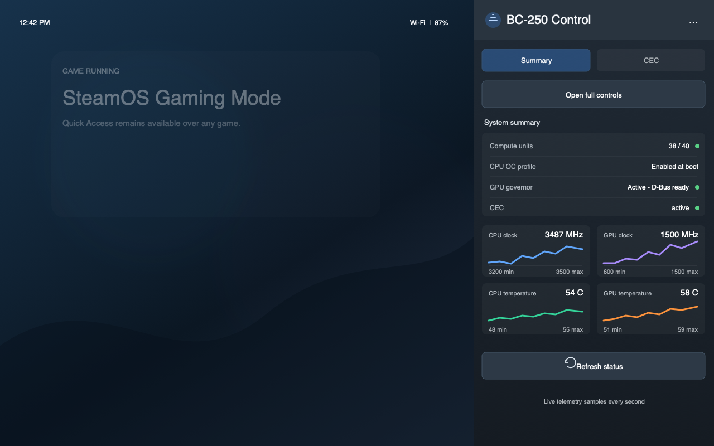
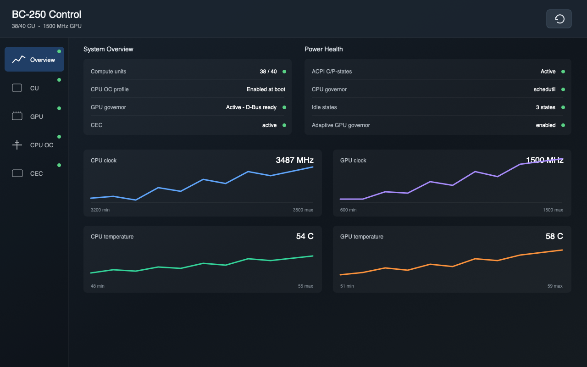
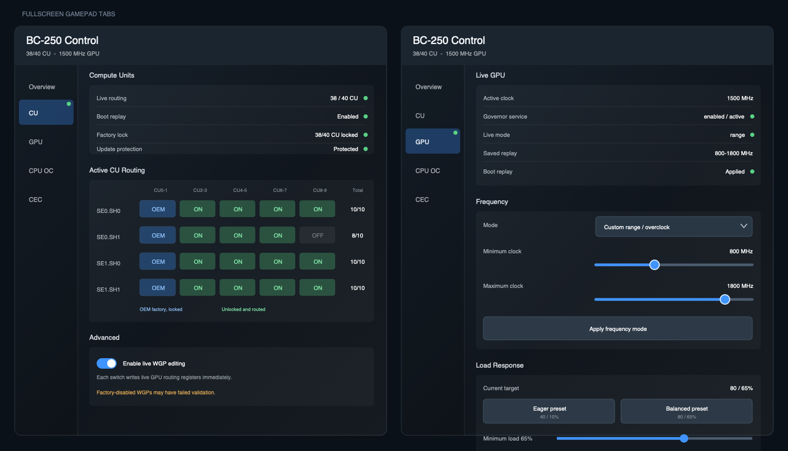
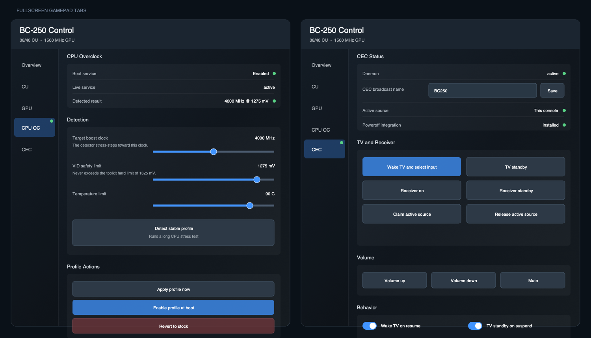

# BC-250 Control

Decky Loader interface for the BC-250 SteamOS toolkit.

## Interface

The Quick Access panel provides a live hardware summary, telemetry graphs, and
CEC quick controls. Select
**Open full controls** for the fullscreen, gamepad-navigable sections:

- CU routing status, saved-table fallback, and guarded live WGP controls
- Full system, ACPI, governor, and temperature health
- GPU frequency, load target, and ramp behavior
- CPU overclock detection, apply, boot replay, and stock restore controls
- HDMI-CEC controls

GPU voltage editing and saving WGP routing for boot remain in the toolkit CLI.

## UI Overview

These mockups follow the implemented Decky React interface and use
representative healthy values from the backend schema. They are UI previews,
not captures from BC-250 hardware; final typography and focus decoration follow
the installed Steam client and Decky theme.

### Quick Access Panel



The plugin opens as a narrow Quick Access overlay without leaving the current
game. **Summary** provides service health and one-second CPU, GPU, and
temperature history. **CEC** switches the same panel to compact TV, input, and
volume actions. **Open full controls** closes the side menus and navigates to
the controller-focused fullscreen route.

### Fullscreen Overview



Fullscreen controls use a vertical gamepad-navigation rail. Each tab carries a
green or amber health dot, and focus moves directly between the rail and the
scrolling content. Overview expands the Quick Access telemetry with power,
ACPI, governor, persistence, CPU profile, CU, and CEC status.

### CU Routing and GPU Tuning



The CU grid distinguishes locked factory WGPs from routed and disabled pairs.
Live editing requires the explicit advanced toggle and a destructive
confirmation for every register change. GPU controls expose live and saved
state, frequency modes, load-response presets and thresholds, ramp timing, and
the read-only voltage curve. Sustained clock modes also require confirmation.

### CPU Tuning and CEC



CPU tuning keeps bounded clock, voltage, and temperature inputs together with
long-running detection and clearly separated apply, boot-enable, and stock
restore actions. The full CEC tab adds broadcast-name editing, receiver
controls, power integration, and behavior toggles beyond the compact Quick
Access actions.

## Requirements

- Decky Loader
- Toolkit checkout at `~/.local/share/bc250-fixes/bc250-steamos`
- Installed toolkit components for the controls being used

The plugin backend runs with Decky's `root` flag. CEC commands are delegated to the logged-in Deck user session.

### Privileged operations

Decky starts `main.py` as root because `plugin.json` declares the `root` flag.
Privileged operations use typed RPC methods, validated arguments, fixed command
paths, and argument allowlists. CEC operations use `runuser` with a clean user
session environment. Live WGP changes are delegated to a root-owned CU manager;
user-writable copies are rejected. Privileged helpers, UMR, and state use the
root-owned `/var/lib/bc250-control/` SteamOS offload mount.

## Install

```bash
cd decky-plugin
./install.sh
```

The script installs pnpm and Node.js to the update-proof home directory if
missing, builds the plugin, runs the tests, copies the runtime files to
`~/homebrew/plugins/BC-250 Control/`, and restarts Decky. Run it as the deck
user; the copy and restart use sudo. Re-run it after any code change.

## Build

```bash
cd decky-plugin
pnpm install
pnpm run typecheck
pnpm run build
cd ..
PYTHONPATH=backend:backend/vendor python3 -m unittest discover -s backend/tests
python3 scripts/stage-decky-runtime.py
```

The frontend bundle is written to `dist/index.js`. The complete, independently
installable plugin runtime is staged at `decky-plugin/out/`; it includes private
copies of `bc250_control` and the Python 3.8 `tomli` fallback.

## Backend

`main.py` exposes a typed RPC surface backed by the runtime's private
`py_modules/bc250_control/`. The canonical source lives in `backend/` and is
copied into the Decky artifact at build time; the installed plugin never imports
or calls the Plasma desktop utility. Hardware mutations are serialized and
validated. Privileged GPU changes use fixed D-Bus, configuration interfaces, or
the trusted CU manager. CEC commands invoke a toolkit script after dropping to
the logged-in Deck user.

`tomli` is vendored under `py_modules/` for the Python 3.8 runtime shipped by older SteamOS releases.
