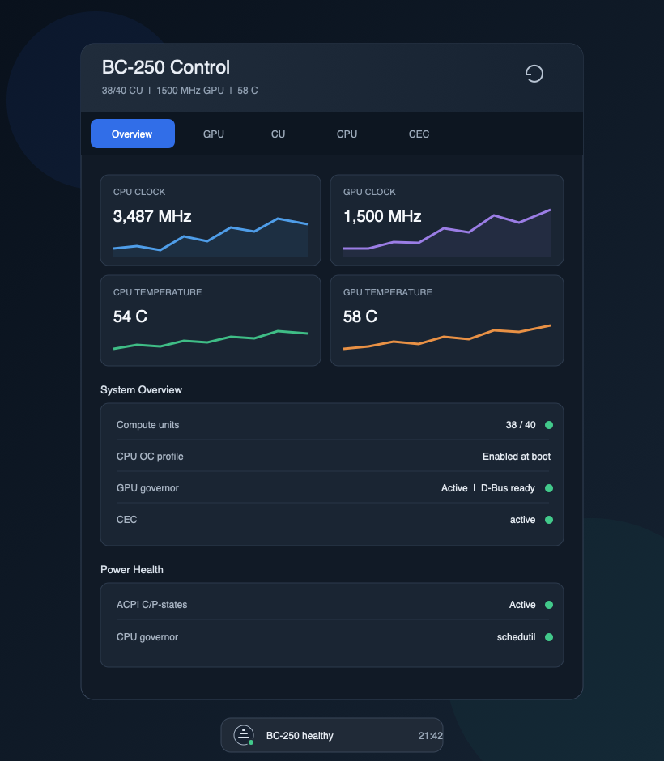
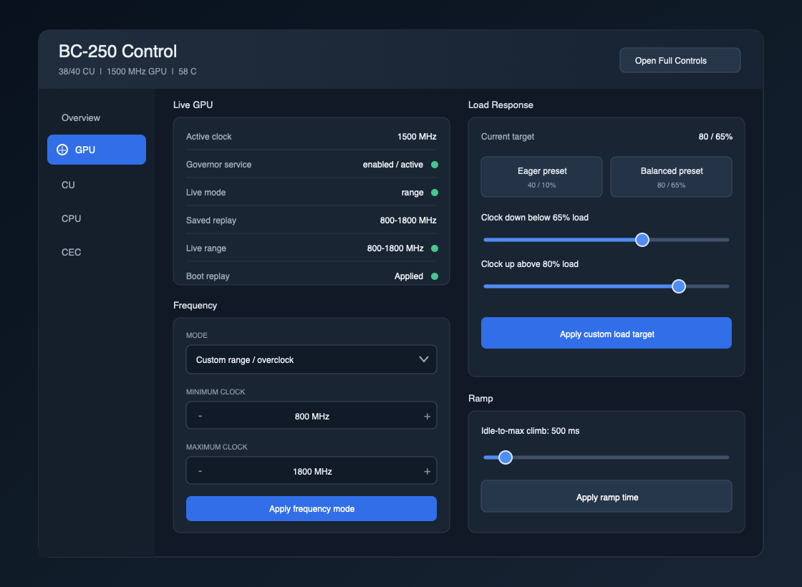
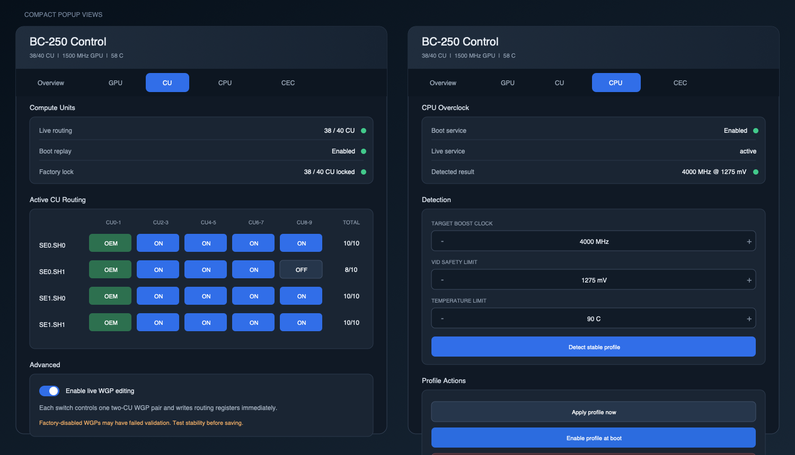
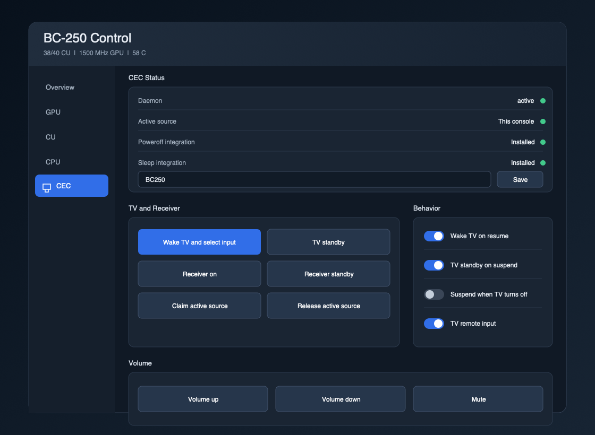

# BC-250 Plasma Desktop Control

Native Plasma 6 system-tray controls for the BC-250 SteamOS toolkit. The
desktop package has its own root service and private backend copy. It does not
require Decky Loader or the BC-250 Decky plugin.

## Install

Run from the toolkit checkout as the logged-in desktop user:

```bash
bash desktop-control/install.sh install
```

The installer requests `sudo` for the root-owned service, installs the
plasmoid for the current user, and preserves the integration across SteamOS
atomic updates. Add **BC-250 Control** under **Configure System Tray > Entries**
if Plasma does not display it immediately.

The tray popup includes Overview, GPU, CU, CPU, and CEC controls. Select
**Open Full Controls** to run the same responsive interface through
`plasmawindowed`.

## UI Overview

These dark-theme mockups follow the implemented Plasma QML and use
representative healthy values from the bundled mock backend. They are UI
previews rather than screenshots from BC-250 hardware; colors and control
styling follow the active Plasma theme at runtime.

### Overview and System Tray



The compact representation shows a health icon and status dot. Opening it
reveals top navigation for the five control areas. Overview displays live CPU
and GPU clocks, temperature history, CU availability, governor state, CEC
health, and boot-persistence status. Telemetry polling runs only while the
Overview tab is visible.

### GPU Controls



The wider `plasmawindowed` layout moves navigation into a sidebar. The GPU tab
shows the live and saved frequency modes before exposing adaptive ranges,
pinned clocks, load-response targets, and ramp timing. Potentially sustained
clock modes display a confirmation before applying. Privileged changes request
polkit authorization once for the current login session.

### CU Routing and CPU Tuning



The CU tab presents all four shader rows as two-CU WGP pairs. Factory-routed
pairs are visibly locked, and live editing remains behind an explicit advanced
toggle and confirmation. The CPU tab reports the active profile, provides
bounded detection inputs, and separates immediate application, boot enablement,
and stock reversion. Longer sections scroll within the popup.

### CEC Controls



The CEC tab combines daemon and active-source status with TV, receiver, volume,
and behavior controls. It also edits the 14-byte CEC broadcast name. CEC reads
and actions do not require a polkit prompt, while the service still validates
every command and argument.

## Commands

```bash
bash desktop-control/install.sh status
bash desktop-control/install.sh uninstall
```

Uninstalling the desktop control leaves Decky and shared toolkit helpers,
state, UMR, GPU tuning, CPU profiles, and CEC configuration intact.

## Runtime Isolation

The service runtime is installed under `/var/lib/bc250-control/desktop` with
private copies of `bc250_control`, `tomli`, and `dbus_next`. The Decky artifact
separately embeds `bc250_control` under its own `py_modules` directory. Neither
UI package imports from or invokes the other.

Both backends follow the same lock protocol at
`/run/lock/bc250-control/backend.lock` so independently installed versions do
not mutate hardware concurrently.

See `plasmoid/README.md` for the QML layout and D-Bus API details.
